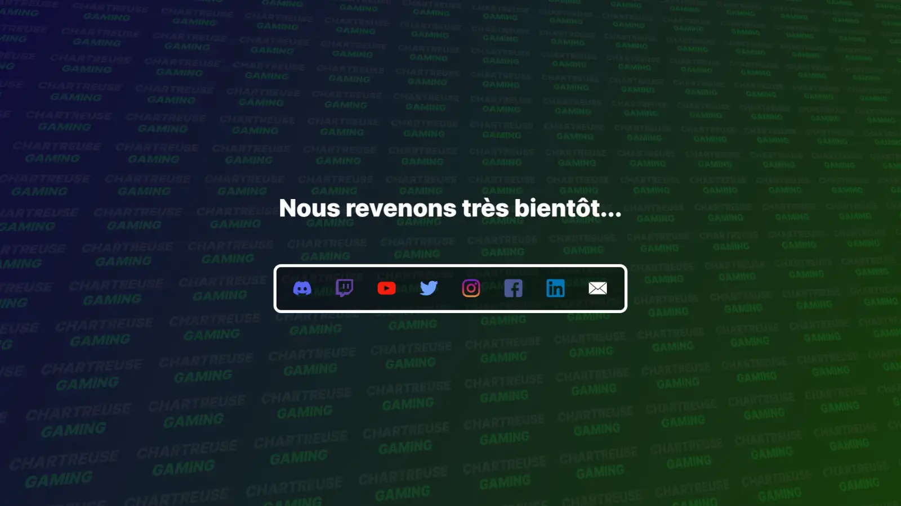

<div id="top"></div>
<br />

<div align="center">
<a href="https://github.com/Chartreuse-Gaming/Maintenance">
    
</a>

<h3 align="center">Maintenance</h3>

&nbsp;
&nbsp;
&nbsp;


  <p align="center">
    Website maintenance page of the Chartreuse Gaming association.
    <br />
    <a href="https://chartreusegaming.fr/"><strong>chartreusegaming.fr »</strong></a>
  </p>
</div>
<br />

<details>
  <summary>Table of Contents</summary>
  <ol>
    <li>
      <a href="#about-the-project">About The Project</a>
      <ul>
        <li><a href="#features">Features</a></li>
        <li><a href="#tech-stack">Tech Stack</a></li>
        <li><a href="#color-reference">Color Reference</a></li>
      </ul>
    </li>
    <li>
      <a href="#getting-started">Getting Started</a>
      <ul>
        <li><a href="#prerequisites">Prerequisites</a></li>
        <li><a href="#run-locally">Run Locally</a></li>
        <li><a href="#deployment">Deployment</a></li>
      </ul>
    </li>
    <li><a href="#roadmap">Roadmap</a></li>
    <li><a href="#feedback">Feedback</a></li>
    <li><a href="#author">Author</a></li>
  </ol>
</details>

## About The Project

Maintenance page of the Chartreuse Gaming association website with links to the different social networks.

<div align="center"> 
  
</div>

### Features

- Links to social networks
- Gradient background with repeating text
- Responsive Design

### Tech Stack

- [VueJS 3](https://vuejs.org/)
- [Sass](https://sass-lang.com/)
- [Vue-i18n](https://vue-i18n.intlify.dev/)

### Color Reference

| Color                            | Hex                                                                           | Description                         |
|----------------------------------|-------------------------------------------------------------------------------|-------------------------------------|
| Background Color left            |  `#0F0B3DFF` | Gradient color at left              |
| Background Color right           |  `#173D09FF` | Gradient color at right             |
| Background Text Primary Color    |  `#686868FF` | Primary color for background text   |
| Background Text Secondary Color  |  `#23D940FF` | Secondary color for background text |
| Text Color                       |  `#FFFFFFFF` | Text color                          |
| Social Networks Border Color     |  `#FFFFFFFF` | Icon color                          |
| Social Networks Background Color |  `#0000004C` | Icon background color               |

<p align="right">(<a href="#top">back to top</a>)</p>

## Getting Started

### Prerequisites

- Install [NodeJS](https://nodejs.org/) with [npm](https://www.npmjs.com/)

```bash
  curl -fsSL https://deb.nodesource.com/setup_16.x | sudo -E bash -
  sudo apt-get install -y nodejs
```

### Run locally

1. Clone the project

```bash
  git clone https://github.com/Chartreuse-Gaming/Maintenance
  cd website
```

2. Install dependencies

```bash
  npm install
```

3. Start the server

```bash
  npm run serve
```

The server should start on [localhost:8080](http://localhost:8080/).

### Deployment

To deploy this project run

```bash
  npm run build
```

A new `dist` folder will appear containing the entire compiled website.

<p align="right">(<a href="#top">back to top</a>)</p>

## Roadmap

### v1

- [x] Add links
- [x] Add custom background svg
- [x] Responsive design
- [x] Improve project size

### v2

- [x] Migrate to [VueJS](https://vuejs.org/)
- [x] Reduce build size
- [x] Add translations
- [x] [Sass](https://sass-lang.com/) CSS Preprocessor

### v3
- [ ] Migrate to [Astro](https://astro.build/)
- [ ] Reduce build size

<p align="right">(<a href="#top">back to top</a>)</p>

## Feedback

If you have any feedback, please reach out to us at [ChartreuseGGaming@gmail.com](mailto:ChartreuseGGaming@gmail.com).

<p align="right">(<a href="#top">back to top</a>)</p>

## Author

[@Minarox](https://www.github.com/Minarox)

<p align="right">(<a href="#top">back to top</a>)</p>
