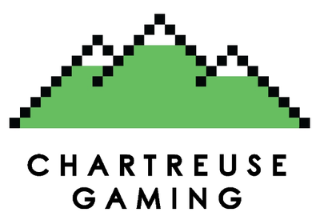
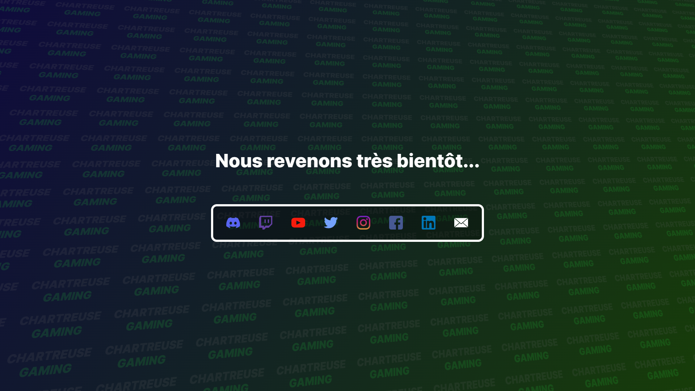

<div id="top"></div>
<br />

<div align="center">
<a href="https://github.com/Chartreuse-Gaming/maintenance">
    
</a>

<h3 align="center">Maintenance</h3>

&nbsp;
&nbsp;
&nbsp;


  <p align="center">
    Website maintenance page of the Chartreuse Gaming association.
    <br />
    <a href="https://chartreusegaming.fr/"><strong>chartreusegaming.fr »</strong></a>
  </p>
</div>
<br />

<details>
  <summary>Table of Contents</summary>
  <ol>
    <li>
      <a href="#about-the-project">About The Project</a>
      <ul>
        <li><a href="#features">Features</a></li>
        <li><a href="#tech-stack">Tech Stack</a></li>
        <li><a href="#color-reference">Color Reference</a></li>
      </ul>
    </li>
    <li>
      <a href="#getting-started">Getting Started</a>
      <ul>
        <li><a href="#run-locally">Run Locally</a></li>
        <li><a href="#deployment">Deployment</a></li>
      </ul>
    </li>
    <li><a href="#roadmap">Roadmap</a></li>
    <li><a href="#feedback">Feedback</a></li>
    <li><a href="#author">Author</a></li>
  </ol>
</details>

## About The Project

Maintenance page of the Chartreuse Gaming association website with links to the different social networks.

<div align="center"> 
  
</div>

### Features

- Links to social networks
- Gradient background with repeating text
- Responsive Design

### Tech Stack

- HTML
- CSS

### Color Reference

| Color                            | Hex                                                                           | Description                         |
|----------------------------------|-------------------------------------------------------------------------------|-------------------------------------|
| Background Color left            |  `#0F0B3DFF` | Gradient color at left              |
| Background Color right           |  `#173D09FF` | Gradient color at right             |
| Background Text Primary Color    |  `#686868FF` | Primary color for background text   |
| Background Text Secondary Color  |  `#23D940FF` | Secondary color for background text |
| Text Color                       |  `#FFFFFFFF` | Text color                          |
| Social Networks Border Color     |  `#FFFFFFFF` | Icon color                          |
| Social Networks Background Color |  `#0000004C` | Icon background color               |

<p align="right">(<a href="#top">back to top</a>)</p>

## Getting Started

<!-- Installation -->

### Run locally

1. Clone the project

```shell
  git clone https://github.com/Chartreuse-Gaming/maintenance
  cd maintenance
```

2. Open `index.html`.

### Deployment

To deploy the project, simply point a virtual host of your web server ([Apache](https://httpd.apache.org/)
, [NGINX](https://www.nginx.com/) or other web servers) in the project folder.  
There is no specific configuration to set up.

<p align="right">(<a href="#top">back to top</a>)</p>

## Roadmap

- [x] Add links
- [x] Add custom background svg
- [x] Responsive design
- [x] Improve project size

<p align="right">(<a href="#top">back to top</a>)</p>

## Feedback

If you have any feedback, please reach out to us at [ChartreuseGGaming@gmail.com](mailto:ChartreuseGGaming@gmail.com).

<p align="right">(<a href="#top">back to top</a>)</p>

## Author

[@Minarox](https://www.github.com/Minarox)

<p align="right">(<a href="#top">back to top</a>)</p>
